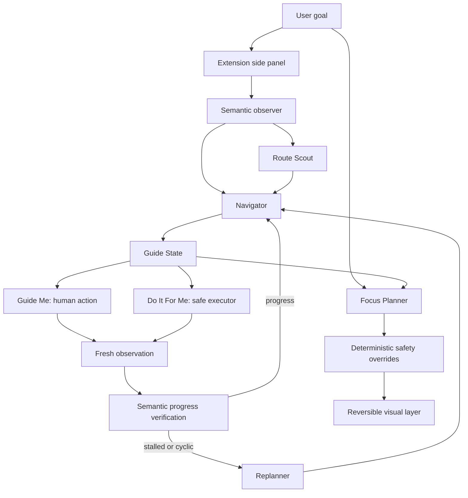
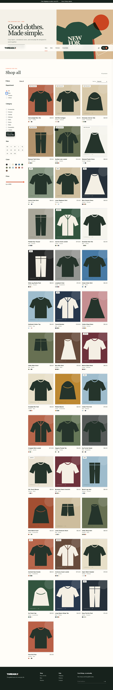
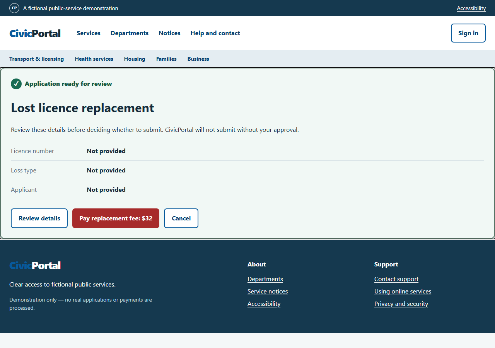

# GuideMode

GuideMode is a goal-conditioned browser assistant that turns an existing webpage into a temporary guided interface for what the user is trying to accomplish.

It is intended for people with low digital confidence, older adults navigating unfamiliar digital workflows, and anyone facing a complex unfamiliar website. These are intended users; we have not conducted a formal older-adult user study.

- **Guide Me** identifies and visually explains the next verified step while the user remains in control.
- **Do It For Me** performs bounded browser actions and pauses before sensitive or consequential steps.

The final benchmark runtime is frozen **Agent Core v2** (`ac958d97a549780876f5256a8f9e50e691187ee1`). The final product is the Manifest V3 extension using a v2-derived adapter. Agent Core v2.1 and v2.2 are preserved rejected experiments.

## The problem

Websites expose navigation, terminology, warnings, and workflow choices at once. The bottleneck for an unfamiliar task is often deciding what matters next—not merely clicking. This matters most where a mistake has financial, identity, or public-service consequences.

## What GuideMode does

GuideMode starts only after an explicit goal. It observes the current tab as bounded semantics, asks a Navigator for one safe next step, and verifies fresh browser state. A Replanner handles failures, stalls, and cycles. The visual layer focuses one current target while preserving critical, consequential, and uncertain information. With no goal, it makes no model calls and does not style, highlight, or scroll the page.



Evaluator ground truth is separate and never enters a model prompt.

## Demo

| Idle—no goal | Goal-conditioned step | Manual safety boundary |
|---|---|---|
|  |  |  |

[All eight goal-conditioned screenshots](artifacts/guidemode-goal-conditioned-2026-08-30T18-17-27-440Z/)

## Safety model

The model chooses only bounded actions using supplied opaque refs. It cannot provide selectors, XPath, JavaScript, arbitrary URLs, or arbitrary query strings. Refs expire with each observation; single-flight sessions and generation checks reject late/stale actions. Passwords, identity numbers, payment data, CAPTCHA, authentication, purchases, payments, and consequential submissions pause for the human. Tests used synthetic or public pages, no private production data, and executed zero prohibited consequential actions.

## Measured results

| System | Threadly success |
|---|---:|
| Fair Baseline v1 | 3/10 (30%) |
| Agent Core v2 | 10/10 (100%) |

This is a **+70 percentage-point** improvement and **3.33×** the baseline success rate. CivicPortal improved from v1's 4/6 to v2's 5/6. Focus Planner achieved 12/12 relevant-control recall and zero unsafe omissions. [RESULTS.md](RESULTS.md) is the canonical metrics source.

## Try the extension

```powershell
npm install
npx playwright install chromium
Copy-Item .env.example .env
# Set GEMINI_API_KEY in .env
npm run extension:server
```

Open `chrome://extensions` or `edge://extensions`, enable Developer mode, choose **Load unpacked**, and select `guidemode-extension/`. See [REPRODUCING.md](REPRODUCING.md).

## Repository structure

```text
agent-core-v2/               final frozen benchmark runtime
agent-core-v2.1/             rejected finish-validation experiment
agent-core-v2.2/             rejected compatibility/context experiment
civic-portal/                synthetic public-service domain
guidemode/                   frozen visual layer
guidemode-extension/         Manifest V3 product
guidemode-extension-server/  local Gemini adapter
production-eval/             frozen external manifest
trajectories/                evaluation evidence
artifacts/                   screenshots
```

## Limitations and main failure mode

GuideMode depends on website semantics. Custom controls, closed shadow roots/canvas, incomplete accessible semantics, ambiguous committed-result state, and unusual routing can leave insufficient evidence. Examples are CivicPortal's expired-eight-month wrong workflow, Edenrobe's checked-vs-committed filter ambiguity, and a GOV.UK Guide Me run classified `SITE_INCOMPATIBLE`. Model latency remains the largest extension bottleneck.

## Improvement journey and instructions

See [IMPROVEMENT_CHANGELOG.md](IMPROVEMENT_CHANGELOG.md), [TRAJECTORIES.md](TRAJECTORIES.md), and [AGENT_INSTRUCTIONS.md](AGENT_INSTRUCTIONS.md).

## Hot Take

**More browser metadata is not necessarily better context.** Stable v2 scored 10/10 with 181,468 input tokens, 3.5 calls/task, and 18.24 s/task. v2.2 fell to 9/10 with 627,413 input tokens, 5.0 calls/task, and 23.50 s/task. Extra geometry led Gemini to treat visually hidden but label-executable controls as unusable. Expose task-relevant semantics, not every fact the runtime knows.

## Built during the hackathon / external components

The synthetic sites, agents, evaluations, Focus Planner, visual layer, Route Scout, lifecycle hardening, GuideState, and extension integration are represented by this repository's hackathon history. External tools were not created by this project: Node.js, npm, Chromium, Playwright, Gemini/`@google/genai`, and `dotenv`. Motion examples were inspiration only; Motion is not a dependency and no Motion code/assets were copied. See [LICENSE.md](LICENSE.md).

## License

No repository-wide project license has yet been selected. See [LICENSE.md](LICENSE.md).
